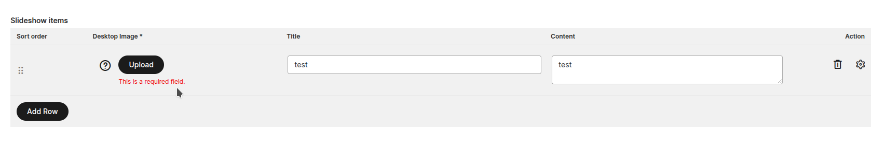
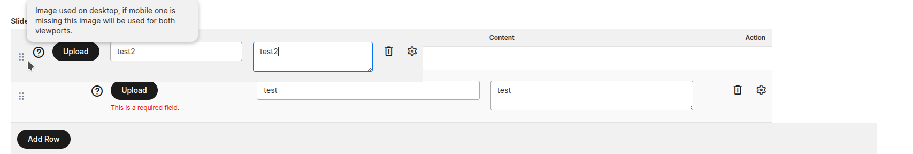
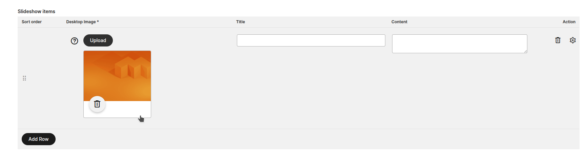
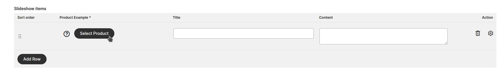
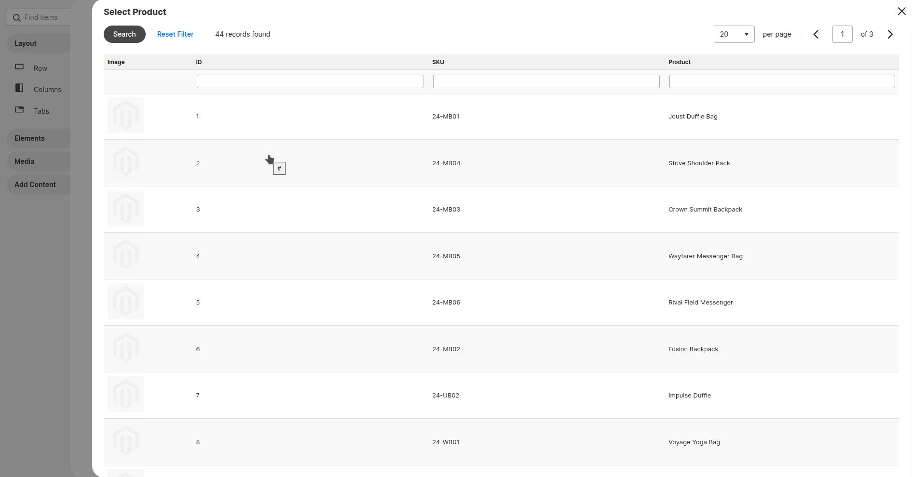

# AdvancedWidget — Store Manager Guide

This guide explains how to use **MageOS AdvancedWidget** from the Magento Admin panel. No coding knowledge required.

---

## Overview

**MageOS AdvancedWidget** extends the Magento widget system with advanced configuration capabilities. The main feature is **multi-row settings**: widgets can expose repeatable sections where store managers can add, edit, sort, and remove an unlimited number of rows — each with its own set of fields.

Additional field types are also available: image picker, product picker, and select fields, giving agencies the tools to build rich, data-driven widget configurations without writing custom Page Builder UI components.

### For agencies

The module is designed to let development teams build advanced CMS widgets with complex, repeatable configurations and a broad set of field types. Combined with **MageOS PageBuilderWidget**, it becomes possible to create fully custom Page Builder components — complete with canvas preview and multi-row settings — without the need to develop custom Page Builder UI components from scratch.

---

## How it Works

### Title Separators

Widgets can include visual section separators to group related fields and make long configuration panels easier to navigate.

---

### Repeatable Sections (Multi-row)

The core feature is the ability to define **repeatable sections** — areas where you can add an unlimited number of rows, each containing its own set of fields.

#### Tooltips

Each field inside a row can show a tooltip to guide you on what to enter.

#### Validation

Fields marked as required will be validated before saving. The form will highlight any missing values.

#### Sorting

Rows can be reordered by dragging the sort handle on the left side of each row.

#### Inline vs. Modal editing

Some fields are editable directly in the main row. Others require opening a detail modal for editing — the developer decides this per field.

---

### Image Field

Rows can include an image picker that opens the Magento media gallery, letting you select or upload an image.

---

### Select Field

Rows can include dropdown select fields with predefined options.

---

### Product Field

Rows can include a product picker that opens a product search grid.

---

## FAQ

**Is this module able to work together with PageBuilderWidget?**

Of course — it was developed for that scope! AdvancedWidget depends on MageOS PageBuilderWidget and the two modules are designed to be used together to build custom Page Builder components with advanced configurations.

**Are multi-row configurations working together with template import/export?**

Absolutely. No need to specify anything special to make it work — multi-row data is handled transparently by the import/export process.
