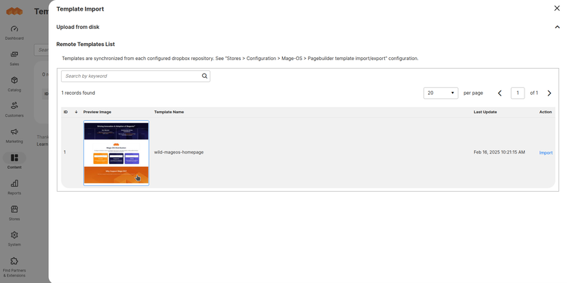
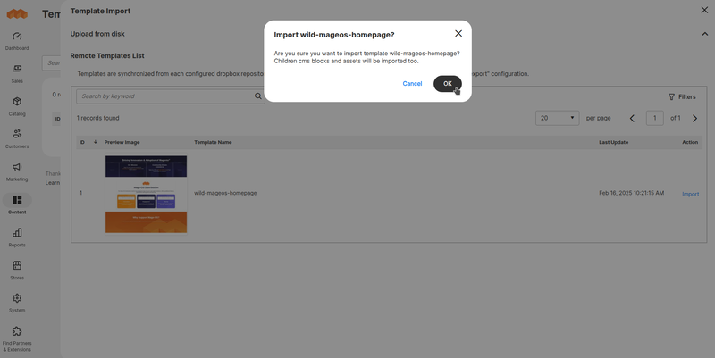
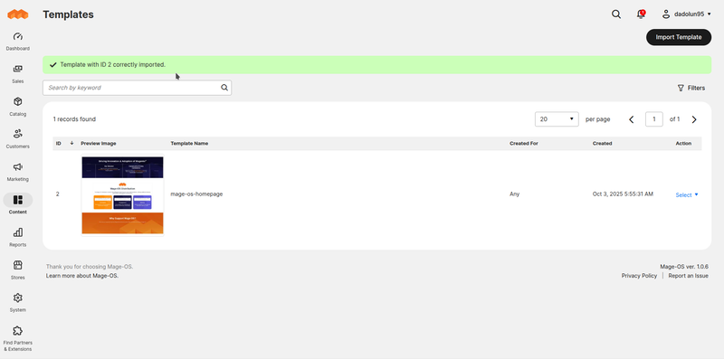
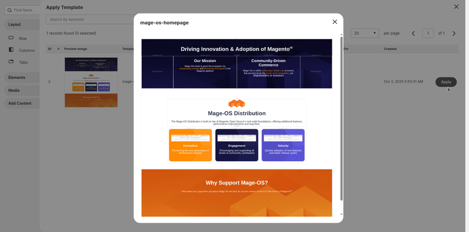
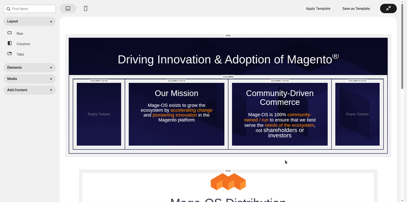
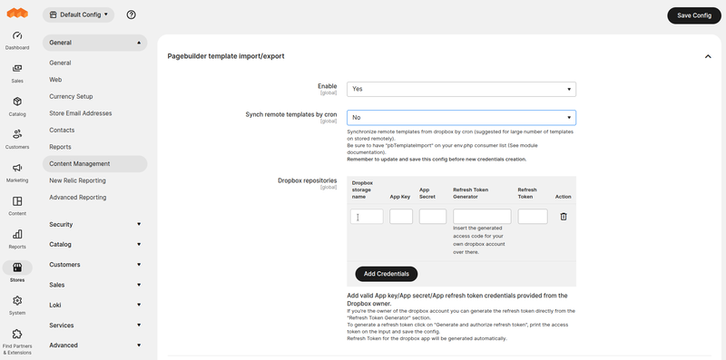
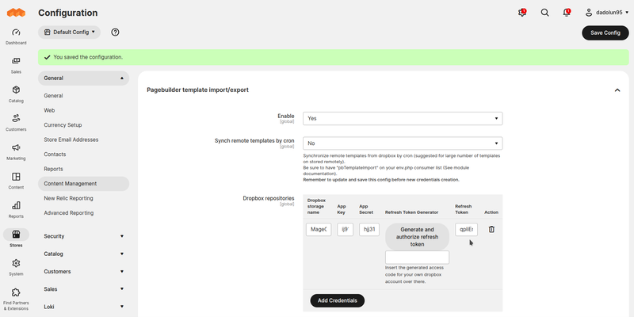

# PageBuilder Template Import/Export — Store Manager Guide

This guide explains how to use **MageOS PageBuilder Template Import/Export** from the Magento Admin panel. No coding knowledge required.

---

## Overview

**MageOS PageBuilder Template Import/Export** extends the native Magento PageBuilder template system with the ability to move templates between Magento instances. Templates can be:

- **Exported** as a `.zip` file and shared manually between environments.
- **Imported** from a local `.zip` file directly through the admin panel.
- **Pulled remotely** from a configured Dropbox storage, enabling a centralised repository of templates shared across multiple Magento instances.

---

## Exporting Templates

Go to **Content > Elements > Templates**. For each template in the grid, use the **Actions** column to export it. The result is a `.zip` file you can download locally and share with other instances.

---

## Importing Templates

From the same **Content > Elements > Templates** page, click the **Import Template** button at the top of the grid. A modal opens with two options:

### Local import

Click **Upload** in the modal, select a `.zip` file previously exported from another instance, and confirm. The template is imported immediately and appears in the grid.

### Remote import (Dropbox)

If one or more Dropbox repositories have been configured (see [Configuration](#configuration) below), the modal also lists all templates available in those remote repositories. You can filter the list and click **Import** on the Action column of any remote template to pull it into the current instance.







---

## Applying an Imported Template

Once imported, templates are available in the PageBuilder panel like any other template. Open a Page Builder-enabled content area, click the Templates icon, and select the imported template to apply it.





---

## Configuration

Go to **Stores > Configuration > General > Content Management > PageBuilder Template Import/Export**.

### General settings

| Option | Description |
|---|---|
| **Enable** | Enables or disables the module. Configurable at global scope. |
| **Sync remote templates by cron** | When enabled, remote template lists are synchronised once per day at midnight. When disabled, synchronisation happens immediately after configuration save. Cron mode is recommended for large remote repositories. |
| **Dropbox repositories** | Multi-row configuration for adding one or more Dropbox apps as remote template sources. |

---

### Configuring a Dropbox repository

Dropbox repositories are added as rows in the **Dropbox repositories** multi-row configuration. Each row requires:

- **Name** — a label to identify this connection.
- **App key** and **App secret** — found in the Dropbox developer console at [dropbox.com/developers/apps](https://www.dropbox.com/developers/apps), or provided by the repository owner.
- **Refresh token** — see below.

#### If you own the Dropbox account

1. Fill in Name, App key, and App secret.
2. Click **Generate and authorise refresh token** and follow the instructions to obtain a one-time access code.
3. Paste the access code in the input below the **Refresh Token Generator** column and click the button.
4. Save the configuration with the main **Save** button.
5. If no errors occurred, the fifth column of the row now shows the generated refresh token.

#### If a vendor owns the Dropbox account

Fill in Name, App key, App secret, and the refresh token supplied directly by the repository owner.

---

### Creating a Dropbox app

To connect a Magento instance to your own Dropbox account, first create a Dropbox app at [dropbox.com/developers/reference/getting-started](https://www.dropbox.com/developers/reference/getting-started):

1. **Choose an API** — select **Scoped Access**.
2. **Choose the type of access** — select **Full Dropbox**.
3. **Name the app** — e.g. `My Mage-OS Template Storage`.





---

### Dropbox app permissions and webhooks

In the Dropbox app settings, grant the following permissions:

- `files.metadata.read`
- `files.content.read`

If you manage the Dropbox space directly, you can also configure a webhook for real-time synchronisation. Add the following endpoint under **Webhook URIs** in the app settings:

```
https://www.mysite.com/pagebuildertemplateie/template_remote/sync
```

When the webhook is active, any change in the Dropbox folder is reflected in Magento immediately without waiting for the scheduled cron. If you do not own the Dropbox account, ask the repository owner to register the webhook on their end.
