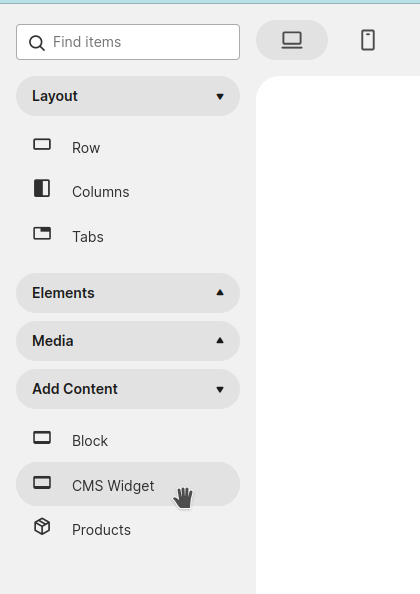

# PageBuilderWidget — Store Manager Guide

This guide explains how to use **MageOS PageBuilderWidget** from the Magento Admin panel. No coding knowledge required.

---

## Overview

**MageOS PageBuilderWidget** introduces a new Page Builder component called **"CMS Widget"**. This component lets you select any available CMS widget and configure all of its parameters directly inside the Page Builder interface. When supported, the Page Builder canvas will show a live preview of the widget content — without leaving the editor.

The component behaves like any standard Page Builder block: it is draggable and can be placed inside other components.

### Frontend agnostic

The CMS Widget component works with every Magento frontend — Luma, Hyva, or any custom theme. There is no dependency on a specific frontend stack, so it can be adopted in any Magento project regardless of the theme in use.

### For agencies

The module is designed to be extended by development teams and agencies. By implementing custom preview templates for their own widgets, agencies can deliver a polished authoring experience to their clients — giving store managers a visual representation of each widget directly on the Page Builder canvas. See the [Developer Guide](developer.md) to learn how to build custom previews.

---

## How to Use

1. Open any Page Builder-enabled content area (CMS Page, CMS Block, product description, etc.).
2. In the Page Builder panel, locate the **"CMS Widget"** component.
3. Drag the component onto the canvas and drop it in the desired position.
4. Click the component to open its settings, select the widget type from the dropdown, and fill in its parameters.

   

5. If a preview has been implemented for the selected widget, it will render directly on the canvas. Otherwise a placeholder is shown.
6. Save your content as usual.

---

## FAQ

**Are the previews automatically generated from the frontend?**

No. Previews require custom development. The module provides the infrastructure to register and display widget previews, but each preview template must be created explicitly by a developer.

**Can already existing widgets be used with this module providing a preview?**

Absolutely. Any existing Magento widget can be extended with a preview. See the [Developer Guide](developer.md) to understand how.
